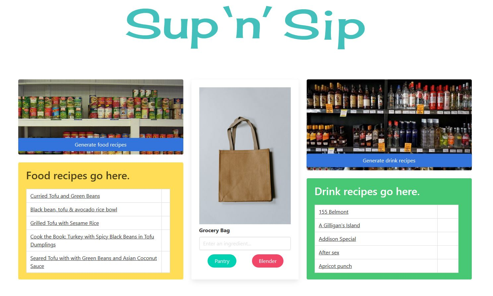

# Sup 'n' Sip: A Dinner 'n' Drink App

https://drivelikejehu.github.io/Sup-N-Sip/

### Motivation

The art of dinner is eroded in the ebb of modern living. Dinner drinks infer a higher-income lifestyle, just slightly out of reach. Our team believes that apéritifs and digestifs should be for everyone, even when resources are limited. 

We achieved this by using two separate API calls and DOM manipulation. Built with Html, Javascript, and jQuery withn the Bulma framework.

### Usage

Users enter their ingredients in the grocery bag, which appear in the blender or pantry on submit. When all ingredients have been exhausted, the user will generate recipes for either side.

### User Story

AS A diner
I WANT to enter in my ingredients
SO THAT I can enjoy drinks with dinner

### Technologies

[Edamam API](https://developer.edamam.com/)

[Cocktail API](https://www.thecocktaildb.com/)

## Contributors

[Michael Knoles](https://github.com/MKnoles78)

[Nat Sakib](https://github.com/nasakib)

[John Kang](https://github.com/drivelikejehu)

### License

Distributed under the MIT license.